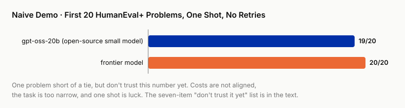

# Start Here · A Two-Hour Win

!!! info "Chapter companion"
    💻 [`code/smol-army`](https://github.com/hallieren/research-rewritten/tree/main/code/smol-army/)

> This chapter skips the argument and gets results first. Two hours from now you will hold an experiment number that makes your heart race, and a list that calms you back down. The two together are the whole book.

This chapter hands you three things. An experiment number you can reproduce in two hours, a seven-item "don't trust it yet" list that shuts it up, and a one-sentence real problem you pick yourself.

---

## Run it first

This book chases one question with you. **Can a team of small open-source models tie a single frontier model?** Frontier here means the strongest batch of commercial closed-source models of the moment. The question is worth real money. Companies that believe "yes" are saving money, companies that believe "no" are paying the bill, and the research literature has not settled the fight. We go through the literature in Chapter 4. Today we read no papers at all and run the most naive version, no team, one small model alone against the frontier.

The materials list has three items.

- A computer that can run Python. The models all go through APIs, no GPU needed.
- Two API keys, one for OpenRouter (calls the open-source small model) and one for OpenAI (calls the frontier model).
- A budget of a few cents.

If you would rather not run code, you do not have to leave. The repository keeps the raw results of my run in `results/demo_naive.jsonl`. Open it and follow the scoring logic along the four steps below. Honestly, reading along does not get you the thrill of a run that works. That thrill comes from a number you produced yourself, and no prose makes up for it. The good news is that the heavy part of this chapter's deliverable is the list that follows, and the list can be read. Readers who follow along can skip straight to the section "19 to 20".

From installing the environment from zero to seeing the score, budget two hours, of which the machine's actual working time is a small fraction. This "two hours" is my two hours, and I write this kind of code every day. If the last time you set up a Python environment was under someone else's guidance, double the budget, and accept one thing in advance. The first time you get any unfamiliar toolchain running, getting stuck is normal, and it has nothing to do with how smart you are. Before you run, spend 15 minutes on the check below.

> **The 15-minute pre-run check**
>
> - [ ] OpenRouter account registered, API key in hand
> - [ ] OpenAI account registered, API key in hand
> - [ ] $1 loaded on each (the demo spends a few cents, but a zero balance stalls on the first problem)
> - [ ] Python 3.11+ and uv installed (uv is the package manager this book uses throughout, `uv --version` prints a version number)

The item on the check most easily underestimated is the third, and what stalls you is often not the money. Both platforms require a foreign credit card, and in some countries and regions that gate is harder to pass than every technical step after it combined. No card, no entry. That is the real admission condition of this demo, and effort will not get around it. I write it here so you do not run into it yourself at minute 40. If you cannot get past it, you still need not leave. Follow along as the previous paragraph describes, and the list this chapter delivers is yours in full.

Two more places in the toolchain where I made an assumption you may not share. First, package management uses uv, not conda or pip. Mixing them produces strange problems, and the repository README guarantees only the uv path. Second, the `export` line that sets environment variables comes from macOS/Linux. On Windows use `set` instead, or `$env:` in PowerShell.

Then, four steps.

**Step 1, install the environment.** Pull down the book's companion repository smol-army (at <https://github.com/hallieren/research-rewritten/tree/main/code/smol-army>), install uv, and set the two keys as environment variables. The README has a one-line export instruction, copy it as is.

**Step 2, get the problems.** The exam is HumanEval+, a code generation benchmark. The plus sign means it added more test cases on top of the original problems, and the problems are the same set. Each problem gives a function description, the model writes the implementation, passing the test cases counts as right, failing counts as wrong, and scoring needs no human opinion. We take the first 20 problems of the dataset.

**Step 3, each contestant answers once.** On the small-model side is gpt-oss-20b, a 20B open-source model whose weights anyone can download. The frontier side's model has most likely been replaced by the time you read this. Swap in the frontier of your day. The number will change, and the seven-item list coming up will not. When I ran it I used GPT-5.6-terra. Each problem gets one chance, single-shot, one call only, no retries, no rerun on failure, no ensembling, no merging answers from several models. The core loop is these few lines.

```python
for it in items:
    text, usage = llm.chat([{"role": "user", "content": it["prompt"]}], seed=0)
    score = tasks.score("code", tasks.extract_code(text), it)
```

**Step 4, count the score.**

```text
$ uv run python scripts/demo_naive.py
...
gptoss: 19/20
frontier: 20/20
```

Done. This is the number I really got, and the raw results sit in the repository at `results/demo_naive.jsonl`. If you ran along and your score does not match 19/20, do not rush to doubt yourself. Remember that feeling. Item 2 on the list is there to serve it.

## 19 to 20



Pause a second and look at what this number says.

GPT-5.6-terra is one of the strongest models money can buy right now, and priced per token it costs tens of times what the small model does. gpt-oss-20b is a 20B model with open weights that anyone can download. Twenty problems, one point apart.

If you are the person your manager asked "can we bring inference cost down," this number looks like the answer. **The small model looks like it can tie.** Make one slide, put this 19 to 20 on it, and Wednesday's review will go very well.

The first time I saw those two lines of output, my reaction was excitement. That excitement is right. It means you have hit a question worth being serious about. The word "looks," though, is the book's number one enemy. The pair of words is **plausible** and **reliable**, and this book calls them by those names from the first page to the last. Everything in this demo stops at the former.

Before sending this number to anyone, I forced myself to write a list. **This conclusion, where I don't trust it yet.**

## Slam the brakes, seven "don't trust it yet" items

The seven items below are all real defects of this demo. Not one is a straw man.

1. **Too few problems.** With 20 problems, one problem is 5 percentage points. The gap between 19/20 and 20/20 looks exactly like one swing of luck, and the eye cannot tell them apart. How many problems are enough, and how to compute a gap so it counts, is the statistical debt of Chapter 8.
2. **Each problem answered only once.** A single sample, no repeats. Rerun at another time and does the number change? I do not know, I did not rerun. If you got 18/20 or 20/20, neither is a surprise. The repeat count and the seed should be locked in before the run, Chapter 6.
3. **Cost not accounted for.** "Tie" is a price word. Frontier tokens cost tens of times more, but how much more, and how many cents each side spent, I did not compute. The `usage` field sits right there in the results file, and I did not read it. A "tie" with no price tag means nothing. The cost basis is set in Chapters 5 and 6.
4. **Only one subject tested, and possibly a leaked one.** No task outside code generation was touched. HumanEval is also one of the best-known code benchmarks, and most likely sits in both models' training corpora. Testing memorized problems tests memory, not ability. How to pick tasks and how to check for contamination, Chapter 6.
5. **No control arm.** When a team really gets formed later and the score really rises, does the credit go to "teaming up" or to "spending a few more samples"? A control arm is the group in an experiment set up to rule out one alternative explanation. The group missing here is "same budget, let one model answer several times and take the majority." Without it, the two explanations cannot be told apart in the numbers. How to design the control arm, Chapter 6.
6. **Nobody reviewed the scorer.** I wrote the scoring code in passing. It says 19, so it is 19? One problem misscored and the whole story gets told differently. The scorer is code too, and code has bugs, Chapter 7.
7. **The first 20 problems are laziness, not sampling.** Who says the first 20 problems of a dataset represent the whole dataset? The hand of whoever arranged them hides in the problem order. The sampling rule should be locked in before the run, Chapter 6 again.

Count them and you will see that most of these seven debts are booked to the same account. **The rules were not locked in before the experiment ran.** That is no coincidence. Every chapter that follows repays a few of them, and this list is the roadmap of the whole book.

## This is not a death sentence for the demo

To be clear. After listing the seven items I did not delete this demo, and I do not regret running it. **An experiment that takes one coffee's worth of time should be run.** It cost 4 cents in total. The arithmetic takes the token counts from the `usage` field in the results file and multiplies by the list prices in the repository's config/prices.toml, checked on 2026-07-25. The frontier side 4.0 cents, the small-model side 0.14 cents. Roughly 30 times apart. This is a simulated account at list price, not a bill, and Chapter 10 will find its deviation on the bill basis. Yes, that is the debt item 3 on the list owes.

Those 4 cents bought three things. A question worth being serious about. First-hand feel, what the two models' APIs look like and what HumanEval+ problems look like. And a code starting point that every serious experiment later reuses. I did only one extra thing. In the repository I labeled it "not preregistered." Preregistration means locking in, before the run, the claim to be tested and the standard for right and wrong. This demo locked in none of that, so this number may only inspire questions, never support conclusions.

There is only one wrong way to treat the demo, which is to run it and go make slides. Between "looks like a tie" and "dare to sign off at the review" lies a whole process. The question has to be sharpened into a falsifiable hypothesis, a judgment the results can overturn. The criteria have to be locked in first, meaning what counts as right and wrong is decided before the run. The experiment has to run reproducibly. The ghosts in the results have to be dragged out one by one. The conclusion has to be written as a deliverable that survives being taken apart. And at the end someone has to beat it up hard. That process is this book. This demo is the first act of the spine case. Every chapter from here on, I push it one gate further, and every item on the seven-item list gets settled along the way, one by one. How it ends, right now I know no more than you.

## One thing while you are here, pick your real problem

Watching someone else run experiments will not teach you to run experiments. While you are here, pick a problem of your own. There are only three criteria. If the answer is wrong, something real gets hurt. All you have right now is a "plausible" answer. Within the next two or three months you really have to take a position on it.

What it looks like in a few different trades.

- **Technology selection**, "Should the retrieval layer be swapped from the current design to a vector database?"
- **Market research**, "Will target users really pay $20 a month for this product?"
- **Policy argument**, "Does the new 'three days a week back in the office' rule have evidence behind it?"
- **Academic topic**, "That line in my thesis proposal, 'A regulates B through some pathway,' how far does the existing evidence carry it?"

Write your problem as one sentence and stick it to the edge of your screen. From Chapter 4 on, every chapter ends with a "Swap in your project" block that translates the step the spine case just took into a concrete action on your project, and this sentence is what it acts on. When you finish this book, what you hand over is a real project that has been run through once in full, not a reading reflection.

**Want an agent to run it with you?** Paste the block below into Claude Code, Codex, or any coding agent:

```text
Clone https://github.com/hallieren/research-rewritten, go into code/smol-army, run uv sync --extra dev and uv run pytest,
then run uv run python -m smol_army.run --mock to walk the whole chain offline, and show me the output verbatim. Then open results/demo_naive.jsonl
and explain to me, problem by problem, how the first 3 problems were scored, following the four-step scoring logic in Start Here. Do not total the score for me, I want to count the 19 to 20 number myself.
If I have OPENROUTER_API_KEY and OPENAI_API_KEY configured, wait until I say go before running uv run python scripts/demo_naive.py,
it will cost a few cents. The seven-item "don't trust it yet" list is mine to write, do not write a single item for me. If any command errors, stop and show me the output.
```

## The unfair advantage you now hold

An experiment number reproduced in two hours, a seven-item list that shuts the number up, and the real problem you just wrote down, are all in your hands. This combination is the first place the book's whole attitude touches the ground. **Move at its speed, hold the line of science.**
