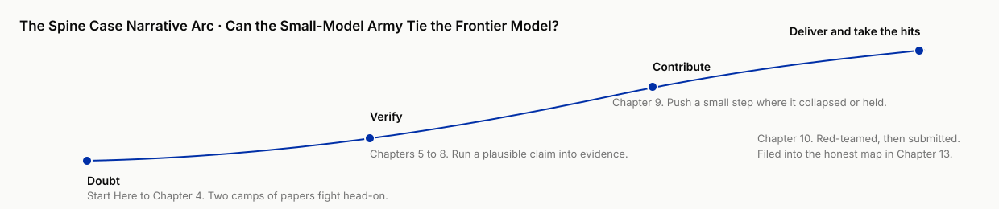

# Chapter 1 · After Coding, Research

!!! info "Chapter companion"
    📋 [Chapter 1 templates](../appendices/ch01-templates.md) · 🗂 [Template index](../appendices/template-index.md)

> An AI research report can dazzle you within ten minutes and embarrass you after you forward it. Those are two faces of the same thing. This chapter states its true shape, and states what this book plans to do about it. (The AI autonomy ladder, the ruler that measures how deep AI can go for you inside one step of the work, is not built until Chapter 3, and the ladder lines at the head of each chapter begin in Chapter 4.)

This chapter hands you three things. A pair of concepts that run through the whole book, plausible and reliable. An operational definition, research is a standard, not a profession. And a map of the whole book, with a self-test that helps you decide whether to keep reading.

---

## 1.1 The last question before you forward it

Friday, four in the afternoon. Your manager messages you. Next Wednesday's review has to settle one thing, whether to self-host the inference service or buy a managed one. He knows you have no time for two weeks of research, so he adds, "A directional call is enough for now."

You open a deep research tool, type in the question, and get up for a glass of water. When you come back the report is on the screen. Nine pages, four sections, two comparison tables, more than twenty cited links, a clear conclusion, a restrained tone. Honestly, it looks better than the survey you spent three days writing by hand last quarter.

You move the mouse to the forward button and stop, maybe because a "too smooth" instinct kicks in. You take a second look at one number. The managed option's total operating cost is 40% lower than self-hosting. Once that number enters the meeting room, the review's conclusion follows it. You ask yourself one question. Where did this number come from?

The report gives two citations. The first is a technical blog post. It exists, but it compares a completely different set of workloads, and the 40% comes from dividing two unrelated numbers. The second is a "2024 industry benchmark report." You search for ten minutes. It does not exist.

Most of the report is right. The framework is useful, and several citations are real and relevant. But a report that is 80% correct, where you cannot locate the 20% that is wrong, may have negative decision value. Yet the confidence it hands you is 100%.

This has happened for real. In 2023 a New York lawyer filed court papers drafted with help from ChatGPT. Several of the cases it cited were invented, and the judge checked and fined him (Mata v. Avianca, Southern District of New York, 2023; a five-thousand-dollar fine). Where he fell was in taking "looks like a precedent" for "is a precedent," and not asking that one question before filing. Using AI itself was not what the court punished.

You may want to say, fine, I will check every citation in the report. You can, and the direction is right. Notice what you just agreed to. Verification takes work, and that work never appeared in the "report in thirty minutes" pitch. The cost of production collapsed. The cost of verification did not. This asymmetry is a structure the book keeps coming back to. Coding hit the same wall two or three years ago, and Chapter 2 covers it in detail.

Two common reactions to this experience, both wrong. The first is to ban it. AI is unreliable, go back to writing by hand. That throws away a machine that really can compress three days of research into thirty minutes, and it does not stop your colleagues or your competitors from using it. The second is to forward it as is, since it is mostly right. That puts your name behind a machine that answers for none of its conclusions. This book offers a third way. **Move at its speed, hold the line of science.** Treat plausible as raw material, and work it into reliable with a method you can run.

## 1.2 Two worlds, the one in the headlines and the one on your desk

First, take apart a common confusion. Right now the phrase "AI does research" covers two worlds that barely touch.

**The first world is in the headlines.** AlphaFold predicted the structures of nearly every known protein, and half of the 2024 Nobel Prize in Chemistry went to Demis Hassabis and John Jumper behind it. The same family holds specialized models for materials discovery, weather forecasting, and gene sequences. They are real scientific achievements, and what they share is that each was built for one specific scientific question, eats specialized data, and produces a specialized answer. You cannot use AlphaFold to answer Friday afternoon's self-host-or-managed question. It has no interface to your work.

**The second world is on your desk.** General-purpose models and agents, model programs that call tools on their own and work through many steps, are entering every step of truth-seeking work. Scanning literature, reading a codebase, proposing hypotheses, writing analysis scripts, running computations, interpreting results, drafting reports, finding fault with their own work. Each step looks too ordinary to matter. Added up, what gets rewritten is **the workflow that produces knowledge itself**. This book is only about the second world. It has an interface to you, it is far larger in volume than Nobel-grade discovery, and nobody is in charge of it. The only inspector of the report on your desk is you. From here on the first world appears only as background.

The distinction earns its own section because confusing the two produces two costly errors at once. One is **overrating by borrowed halo**. If AI can win a Nobel, how could its report be wrong? AlphaFold's reliability was checked point by point against decades of accumulated experimental structure data. The report on your desk went through no corresponding check. No credibility passes between the two. The other is **dismissing by borrowed crash**. If AI even fabricates citations, this whole wave is a bubble. A fabricated citation is one specific, preventable failure mode in the second world (Chapter 11 files it), and using it to dismiss the whole shift is like concluding from early cars breaking down that the combustion engine had no future.

One more thing needs saying plainly. In this book, "AI does research" means AI enters the steps of research. It cannot take the researcher's seat. Asking, deciding, signing, answering for it, those seats are still yours. Chapter 3 gives a four-level ladder for how high AI can stand in each step, and spells it out level by level.

## 1.3 Plausible is not reliable

Now the book's core concept, head on. The pair of words is **plausible** and **reliable**. This book calls them by those names from the first page to the last.

Credit first, honestly. Frontier labs, the handful of labs that train the strongest general-purpose models, built deep research modes that let a model search, read, and synthesize on its own over many rounds, then hand back a cited report. That is a real jump in capability. The breadth is real. In tens of minutes it scans sources you could not cover in days. The quality of the first-pass synthesis holds up too. The structure, the prose, the arrangement of different sources, often beat what a tired human produces before a deadline.

The flaw is in the optimization target. These systems are trained to produce answers people are satisfied with. Fluent, confident, well structured, comprehensive. Those properties get rewarded in training because human raters like them. And to the model, "telling the truth" and "sounding like the truth" come from the same generative skill. The consequence is a structural decoupling. **A report's persuasiveness and a report's correctness are no longer correlated.** A fabricated citation and a real one are identical on the surface of the text. Errors carry no marker, and they do not cluster where you would think to be suspicious. What you saw in section 1.1 is exactly this. The tone of the 40% sentence matched the tone of every true sentence in the report.

Credit and flaw are both on the table. Whether plausible is enough depends on one variable. **What happens if the answer is wrong.**

In plenty of situations it is entirely enough. Planning a trip, getting the gist of a new topic, feeding a brainstorm, writing a stretch of code that a compiler and tests will catch. In these situations the cost of error is low, or the error exposes itself quickly, or a cheap automatic correction catches it. Code that fails to run and errors on the spot is one example. Paying for verification there is waste. This book carries no hostility toward deep research mode. I use it every week, and it is a competent starting point in this book's workflow. The trouble starts only when the starting point is taken for the end.

In another class of situations, plausible is fatal. A review board makes an architecture decision on your numbers. A funding committee decides from your literature review whether to fund the direction. A client decides whether to pay based on your due diligence report. These situations share one thing. **If the answer is wrong, something real gets hurt.**

That is this book's operational definition of research. **Research is a standard, not a profession.** If a wrong answer from you would really hurt something, you are doing research and you need reliable, whatever your title. A PhD student, an engineer doing technology selection, an analyst doing due diligence, a parent checking treatment options for their child, are the same kind of person under this definition. Of that kind, this book writes out the full process for only one, the engineer doing technology selection, whose evidence can be rerun and who signs off in person. The others read the same process, but the shape of the case has to be converted, and Chapter 3, section 3.6 gives the conversion table. Conversely, a casual searcher who is satisfied once "the answer sounds fine" is not doing research, however advanced the tool, and this book cannot help them. Which side you are on, the self-test in section 1.5 will help you judge honestly.

The definition also settles a familiar quarrel in passing. Someone will say, I do not publish papers, why talk about research method. Wrong. Method is discipline forced out by the cost of error, and it never belonged to academia alone. Preregistration, peer review, reproducibility, which is to say writing the hypothesis down and filing it before the run, handing it to peers to find fault, letting others redo it from your description. These academic mechanisms all do one thing. Where a wrong answer costs a lot, humans were forced to invent process to fight their own credulity. Your review meeting, your due diligence, your selection report cost no less when wrong than a paper does, and the same discipline holds for you. It used to cost too much to run, so only academia could afford it. AI brought the cost of running it down, and for the first time this discipline is affordable for everyone.

So what is reliable? It is more practical than "absolutely correct," which science never promises. Its operational definition is **traceable, checkable, and any error can be located**. Every key claim points to a source, and the source exists and really says that. Every key number can state its basis and its method, which is to say what scope and what calculation produced it. Where something is wrong, you can find which step introduced it. In one sentence, this is a report you dare to sign, and dare to let someone who knows the field take apart in front of you. **Reliable is a property of the process, not of the text.** The same report, checked line by line or not checked at all, reads identically and differs enormously in credibility. That is why the only upgrade path runs through method. A smarter model will not buy it.

Will the gap close on its own once models get strong enough? My judgment is no, on two levels. The first is the verified present. As of this writing, the strongest deep research products still produce fabricated citations and numbers whose basis has drifted, meaning a number whose statistical scope or method changed without the report saying so. Public evaluations back this up, not just my impression from use. A full-trajectory hallucination evaluation of six mainstream products (OpenAI, Gemini, Perplexity, Qwen, Grok, Salesforce) found that no deep research agent (DRA) could stay free of fabrication across the whole research trajectory, and two were described as "confident fabricators." The original conclusion reads "no single DRA achieves robust performance across the full trajectory." See "Why Your Deep Research Agent Fails? On Hallucination Evaluation in Full Research Trajectory," 2026, arXiv:2601.22984.

The second is a prediction anchored in history. Every time a tool made "production" cheap, spreadsheets made modeling cheap, statistical software made computing a statistic cheap, "verification," checking whether the output is right, never got cheap along with it. It became the new bottleneck instead. Chapter 2 lays out this pattern with its evidence. The prediction is falsifiable, meaning future facts can overturn it. If a system someday keeps key claims at zero fabricated citations and every number's basis traceable, over a long run and with no human spot checks, this cornerstone of the book should be overturned. I am willing to go that far because the whole book speaks to one standard, **verified, still exploring, and falsified get separate labels**.

## 1.4 Why now

If this tension, production sped up and verification did not keep pace, looks familiar, that is because it just played out in full next door. AI coding ran two or three years ahead of AI research.

The trajectory compresses into one sentence. From code completion, to conversational coding, to coding agents that execute multi-step tasks on their own. Chapter 2, section 2.2 lists the products and years of the three stages.

More valuable is the road programmers as a group traveled in those two or three years. First they laughed, a toy. Then they were dazzled, it writes faster than I do. Then it crashed, it confidently called a function that does not exist. Last came calibration. Learning which work to hand off, which to watch yourself, and which mechanisms (tests, review, tiered authorization) turn a collaborator you cannot fully trust into productivity.

Today most developers' daily workflow already has a place for AI. In the Stack Overflow 2025 Developer Survey, 84% use or plan to use AI tools, and 51% of professional developers use them daily. In the same survey, only a third trust the output. Using it but not trusting it, that group has reached the calibration step. That expensive curve accumulated a batch of lessons that transfer straight into research. Chapter 2 sorts them, along with earlier precedents, into one map. Here only one claim gets planted. **The shift in front of you has a precedent, so you need not guess from zero.**

Beyond a mature precedent, two conditions belong to "now" alone. First, agent capability crossed the threshold of usefulness. A model can take your question and work for tens of minutes to hours without you feeding it sentence by sentence. Steps of the research workflow that were counted in days can, for the first time, be squeezed into hours. Second, cost crossed the threshold of wide access. Capability at this level once belonged only to institutions that could pay large bills. Now, by Epoch AI's March 2025 tracking of six benchmarks, the inference price to reach a given score dropped by a factor of 9 to 900 each year over the past three years. The spread is that wide because different benchmarks lose price at very different speeds, and Epoch itself warns that the steepest drop came in the most recent year and may not persist. The capability line and the cost line crossed recently. That is why this book was written in 2026, not 2023.

Expectations need managing too. This book will not tell you which model or which product to use. Version-level comparisons expire in three months and pull your attention to the wrong layer. Workflows and criteria outlive tool lists by a wide margin. The state of the tools is left to the book's companion online case library to track.

There is one harder reason, and it has nothing to do with whether you use AI. **You can choose not to do research with AI. You cannot choose not to consume research that others did with AI.** Your inbox already holds reports, reviews, and due diligence with deep AI involvement, and most do not say so. They all look right. Telling whether a document "searched fast" or "did research," whether it is plausible or reliable, is moving from a bonus skill to basic self-defense. The earlier you build it, the more it is worth. It compounds.

## 1.5 How to use this book

Cards on the table first. I am an engineer. My daily work is building agents and doing evaluation, the tests that set questions for models and score them, and I live inside the question "do I dare believe this conclusion." The methods in this book are the ones I earn my living with, including the times they fail. The reader it writes the full process for is that same person, a software or AI engineer asked at work to sign off on a technical judgment, where the evidence is an experiment anyone can rerun. Such a person has two kinds of days. The producer's day, when your manager says "look into this" and you have to run it into a conclusion you would sign. The seven chapters of Part II are arranged around that day. And the acceptor's day, when a director forwards a report with deep AI involvement and wants to know by three in the afternoon whether it can be trusted. Chapters 11 and 12 are written for that day. Most people alternate between the two.

The book has four parts, each with one job.

**Part I (Chapters 1 to 3) is the frame.** The chapter you are reading sets the stance. Chapter 2 answers "has this kind of change happened before," distilling AI coding and several earlier tool revolutions into a transfer map, which lays the road other tool revolutions traveled alongside the new road of AI research. Every forward-looking judgment in the book hangs on it. Chapter 3 breaks "truth-seeking" into a seven-step workflow panorama and raises the four-level AI autonomy ladder, **tool → assistant → collaborator → autonomous researcher**, so you can place yourself and your project.

**Part II (Chapters 4 to 10) is the main line, the operational meat.** One chapter per step of the seven-step workflow. Master the field, questions and hypotheses, test design, execution, read and catch errors, delivery, red team. Red team means having someone attack your conclusion on purpose, the same move as red-teaming a model in AI safety. Every chapter gives templates and checklists, specific enough that you can close the book and do one concrete thing on your own project.

**Part III (Chapters 11 to 13) is the cutting edge.** Reliable is cashed in here. File the failure modes unique to research, review AI research output with a verification workflow that works like code review, and hand over an honest map of the present, labeled "verified / still exploring / falsified."

**Part IV (Chapters 14 to 16) looks at roles.** Once the steps are rewritten, where the center of the researcher's craft moves, how teams collaborate, and how this book itself stays current in a field that changes every month.

Two real cases run through the book. **The spine case** advances chapter by chapter from Part II on. It asks whether a team of small open-source models, voting, debating, dividing the work, can tie a single frontier model on a cost-matched basis, meaning both sides spend about the same before scores are compared. Consensus is unsettled, and papers from both camps fight head on in the literature. I run it myself from doubt to conclusion, literature, hypotheses, experiments, delivery, taking criticism, with every pit written up as it happened. **The subplot case** appears in key chapters as a counterpoint and asks, can synthetic data stand in for real data? Use persona-bearing models ("a 25-year-old mom with one child who works at X") in place of real people for user interviews. The answers read like a real person, and it saves time and money, but can it be trusted? What counts as ground truth, and where do the real answers used for checking come from? Engineers get asked this class of question every week. Can synthetic users replace real user testing, can synthetic samples stand in for an eval set. This line asks the same thing as the spine case. Swap the expensive one for a cheap substitute, and do you still dare trust the step you saved? It also holds a suspense that is not resolved until Part III.



There is also a Start Here at the very front of the book. It skips the argument and walks you through building something that runs in two hours, listing on the spot "where I don't trust it yet." That is the spine case's first act. At the same time you pick one real problem of your own. Every chapter in Part II ends with a "Swap in your project" block that translates the step the spine case just took into an action on your own project. When you finish the book, what you deliver is a real project you ran through the whole workflow with your own hands. A reading reflection does not count.

Finally, four questions to help you judge honestly whether to keep reading. The first three decide whether this book is for you. The fourth decides how you read it.

1. If your answer is wrong, does someone, some money, or some decision really get hurt? Yes, this book is written for you. No, what you need is a good search tool, and you can put this book back.
2. Can you accept the premise that "verification takes work"? This book does not sell "reliable in one click." It promises to make the work of verification affordable and reusable. It cannot bring it to zero.
3. Are you willing to work in an unsettled field under a "still exploring" label? This book would rather say "nobody knows here" than fake certainty. If you want a book that is categorical on every page, there are plenty. Do not pick this one.
4. Is your evidence something that can be rerun, code, data, a ledger that can be recomputed? Yes, every step in the book runs on your project as is. No, wet lab, interviews, clinical data, the steps still apply, but the shape of the case has to be converted per Chapter 3, section 3.6, and that section decides how you read Part II.

The full version of this self-test (with scoring) is in this chapter's templates. It takes a minute.

**One thing you can do right now.** Find the most recent AI report you received or generated this week, pick the one number in it that most affects a decision, and spend ten minutes finding its source. There are only three outcomes. Found, and the basis matches. Found, but the basis differs. Not found. Write the result down. The fate of this one number is the trust you should place in the whole report right now.

**Want an agent to run it with you?** Paste this to your AI assistant or coding agent:

```text
Help me do the task at the end of Chapter 1. I will paste you a recent AI report. You do one thing only, list every number in it that would affect a decision,
and after each number write the source the report claims for it, or "none" if it gives no source. I pick which number matters most, and I check the source myself.
You may not search for me, and you may not tell me "this number is probably right." When I come back with the result, you record it as one of three outcomes, found with matching basis,
found with a different basis, not found. At the end I answer the seven-question self-test in the templates file ch01-templates.md myself. You only total the first six questions by the scoring rules. Question seven is not scored.
If any command errors, stop and show me the output.
```

## 1.6 The unfair advantage you now hold

When the next AI report lands in front of you, whether you generated it or someone forwarded it, you can first tell which world it belongs to, searched fast or did research. Then test it on the spot with one question, where did this number come from? The test has only two answers, plausible or reliable. Most people's mouse, at that moment, is still hovering over the forward button.
