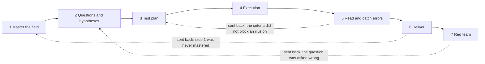
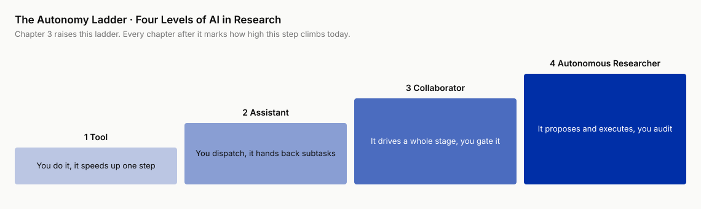

# Chapter 3 · The Truth-Seeking Workflow and the Autonomy Ladder

!!! info "Chapter companion"
    📋 [Chapter 3 templates](../appendices/ch03-templates.md) · 🗂 [Template index](../appendices/template-index.md)

> **This chapter's ladder.** No ladder line. The ladder itself is born in this chapter. From Chapter 4 on, every chapter opens with a ladder line that tells you how high this step can safely climb right now. Everything you need to read that line, this chapter hands over at once.
>
> Two maps. One shows you what serious truth-seeking looks like. The other shows you where AI can stand inside it. By the end of this chapter you can pin your own project onto them.

This chapter hands you four things. A panorama of the seven-step truth-seeking workflow, a four-level autonomy ladder (with four behavioral criteria), a 2026 snapshot, and a conversion table for the five premises that bound where all of this applies, so you can place your own project.

---

## 3.1 One subscription, two outcomes

What follows is a composite scene. The people are synthetic, every step of the workflow is real. Two engineers, same company, same Monday morning, same assignment. A startup claims its vector search engine "cuts latency by 90%", sales is pushing hard, and management wants a call on whether it is worth replacing the current system, answer due Friday. Both engineers use the same AI tool on the same subscription tier.

The first one opens the chat box, pastes the task in as is, and adds "please do deep research." Twenty minutes later he has a fourteen-page report, market landscape, technical architecture, competitor comparison, risk analysis, all there, tidy subheadings, a respectable list of citations. He polishes the wording, adds a cover page, and turns it in on Wednesday.

The second one starts from the same chat box, but he does not hand over the task in one piece. He first has the AI draw a map, which technical routes exist for this kind of engine and what their backers are arguing about. Then he grinds "is it worth replacing" into a question evidence could overturn, "under our real load distribution, can p99 latency, the time taken by the slowest one percent of requests, drop below 50 ms, with the migration cost recovered within a year." Before running any test, he locks in what counts as a win and what counts as a loss. Only then does he have the AI build a small benchmark and run one round on the company's real queries, anonymized. When the numbers come in he does not celebrate, he first checks a few common sources of illusion. Finally he has the AI play the harshest reviewer and attack his own conclusion, patches two holes, and turns in a four-page memo on Friday.

At the review meeting, someone asks both the same question: "That 90%, compared to what, and measured under what load?"

The first one flips through the report and finds only a paraphrase of the startup's own blog. The second one opens his own test basis and scripts: "Their 90% is an idle cold-start comparison. Under our load it is 34%, still considerable, but the migration cost takes 20 months to recover, which exceeds the criterion. Recommendation, wait."

The gap between them is in how they walked. How well the prompt was written explains only a small part. The first one let AI take one step, the second let AI take seven, and stood in a different position on each. One deliverable stopped at plausible. The other reached reliable.

That difference in position is the two maps this chapter delivers. The first map answers which steps truth-seeking is made of. The second answers how high AI can stand on each one.

## 3.2 The truth-seeking workflow, seven steps in a loop

The first map first. In this book, "research" goes by the anchor in Chapter 1, not by profession. So this map has to be domain-neutral. A doctoral thesis, a due-diligence report, a technology selection, a quant strategy, strip off the domain clothing and the skeleton underneath is the same one. That skeleton has seven steps.


**Step 1, master the field.** Turn "can't read it all" into "can ask it something," and work out who claims what in this field, what they are arguing about, and which argument your question lands in. The engineering version is digesting an unfamiliar framework's ecosystem in two weeks, docs, issue tracker, competitor threads, more volume than bandwidth. The academic version is the literature review before a PhD student's proposal, that is, reading the field's papers before starting the research to learn the terrain, finding three camps and five load-bearing papers among four thousand papers. Same problem.

**Step 2, questions and hypotheses.** Grind a blur of curiosity into a question worth answering, one whose answer might embarrass you. The engineering version grinds "should we replace the retrieval layer" into "under our load, can p99 be pushed below 50 ms, with the migration cost recovered within a year." The first can be talked about for a day with no conclusion, the second can be settled in three days of checking. The academic version grinds "this phenomenon is kind of interesting" into a testable hypothesis, and states which observation would kill it.

**Step 3, test plan.** Before running anything, lock in the plan, the method, and the criteria, above all what counts as losing. The engineering version of a performance evaluation sets the test load, the comparison baseline, and the pass threshold before turning on the machines. The academic version is called preregistration. Sample size, test method, exclusion rules signed off first, no door left open for picking data afterward. In an evaluation whose criteria were added later, the conclusion always "happens to" support the plan that was finished first.

**Step 4, execution.** Write the code, run the analysis, run the computational experiment, turn the design into data. The engineering version is building the eval pipeline, running backtests, pulling and cleaning data and fitting models. The academic version has simulations, statistical analysis, experimental pipelines. Of the seven steps, this is the one that overlaps most with AI coding.

**Step 5, read and catch errors.** Sort the results into findings, noise, and bugs. Engineering version, a metric jumped 40% overnight. Real signal, or did an upstream tracking field change yesterday? The academic version asks whether this significance survives a multiple-comparison correction, that is, after testing many groups at once, has the luck of guessing one right been subtracted? Did the data leak? In both settings, the most expensive error looks like the most exciting finding.

**Step 6, deliver.** Turn "I know" into "others can trust," pick the right vehicle, and write the evidence, the limits, and the chain of reasoning into something that stands up to scrutiny. The engineering version is a one-page decision memo for the CTO, an evaluation report for the technical committee. The academic version is the paper, the figures, the point-by-point response letter to reviewers. The vehicles differ. The standard, every number traceable, is the same.

**Step 7, red team.** Before release, let the harshest criticism happen at home first. Review yourself, look for counterevidence, attack your own conclusion. The engineering version is the pre-launch premortem, assume the project has already failed and reason backward to the cause of death, or the colleague whose job in the review meeting is to disagree. The academic version rehearses the reviewers before submission, asking "if I were Reviewer 2, famously the pickiest reviewer on the panel, where would I strike first." The only difference is that now you can hire a tireless opponent at any hour.

Two things must be said clearly now.

**First, this is a loop, not an assembly line.** The seven steps are numbered in teaching order, not in marching order. The most common thing the red team does is send you back to step 2. Interpretation often sends you back to step 3. A paragraph you cannot write clearly at delivery usually exposes a step 1 you never mastered. The second engineer's Friday memo in the opening scene is what came out after a lap and a half around the map.



**Second, this map is the table of contents for Part II.** Chapters 4 to 10, one chapter per step, in the order above. How to do each step, its templates and its pitfalls, all live there. This chapter's only job is to let you see the whole map first.

## 3.3 The autonomy ladder, four levels defined by behavior

The second map answers a different question. In the sentence "AI helps me do research," what does "helps" actually mean? The same "helps" can mean reformatting a citation for you, or deciding for you how the experiment should be designed, and the risk between those two differs by orders of magnitude.

So the four levels of the ladder are not defined by capability adjectives. "Smarter" and "more powerful" are the marketing department's language. The definitions use **behavioral criteria**. There are only four questions. **Who drafts? Who reviews? Who decides? Who answers when it's wrong?** Change the answer to any of the four and the level changes. These four criteria only set the level. They are not the win-or-lose criteria you lock in at step 3, they just share a word.



**Tool level.** You draft, you review, you decide, you answer for it. AI is a single-point executor, translating a methods section, converting thirty citations to another format, turning a table into a chart. One explicit instruction at a time, every output glanced over by you, errors visible on the spot and discarded on the spot. Take one day as an example. You are rushing a review to final draft, you have AI convert the bibliography from one format to another, and along the way it translates two passages from a German paper. The engineer's version of that day has it reformat an API doc and translate two chunks of error output in passing. Through the whole process it never made a single "decision."

**Assistant level.** AI drafts, you review every part in full, you decide, you answer for it. AI takes on bounded subtasks, summarizing a paper, writing a plotting function, drafting the related-work section. The key criterion is the word "review." Every part of the output passes your eyes before it enters your project. Review is the only line of defense, so it has to cover everything. Take one day as an example. You hand ten papers to AI one at a time to distill in a fixed format, and check each card's key passages against the original. In the afternoon you have it draft a section, then edit sentence by sentence until it is unrecognizable, and it is still three times faster than starting from a blank page.

**Collaborator level.** AI drafts and self-checks, and proposes alternatives you had not thought of. You no longer review sentence by sentence. You review the plan, review the key checkpoints, and spot-check by ratio. You decide, you answer for it, but answering for it no longer rests on your eyes alone. It also rests on a process locked in beforehand, tests, criteria, cross-validation, where cross-validation means different sources checked against each other, not the dataset-splitting kind from machine learning. The ticket into this level is **an executable standard of verification**, and no model, however strong, can buy it for you. Without locked-in criteria you have no standing to talk about spot checks. Take one day as an example. In the morning you and AI each propose a version of the experiment plan, pick each other's apart, and merge into a final one. In the afternoon it writes the whole data pipeline end to end, tests all green, and you look closely only at the interface design and three pieces of key logic. Before you log off, the day's numbers are read straight against the thresholds locked in the day before.

**Autonomous researcher level.** AI drafts the whole way, makes the intermediate decisions itself, and reviews itself. The human does two things only, set the goal and the acceptance criteria beforehand, and accept the final product afterward. **Who answers when it's wrong? Right now, nobody.** AI bears no consequences, and the human never reviewed the process step by step, so when something goes wrong nobody catches it in time and nobody can be held responsible. That is exactly why in 2026 this level is common in demo videos and rare in settings where, if the answer is wrong, something real gets hurt. Take one day as an example (still mostly imagined). You leave a research goal before bed and receive a complete analysis report in the morning. The problem is, if one conclusion in it is confidently worded, fluently reasoned, and happens to be wrong, who finds it?

The four levels side by side.

| Level | Who drafts | Who reviews | Who decides | Who answers when it's wrong |
|---|---|---|---|---|
| Tool | You | You (a glance in passing) | You | You; errors visible on the spot |
| Assistant | AI | You, every part in full | You | You; human review is the only line of defense |
| Collaborator | AI (with self-checks and alternatives) | You, checkpoints + spot checks + a locked-in process | You | You + the process; errors hit the criteria first |
| Autonomous researcher | AI (including intermediate decisions) | Mostly AI self-review, the human accepts only the end product | Goals and acceptance criteria stay with the human, the process goes to AI | **Nobody**, the root reason this level is rare |

From assistant to collaborator, the biggest change is that your reviewing switches trades, from reading the output line by line to designing and maintaining a verification process. AI doing more work is the secondary change. For every notch a programmer hands to an agent, the tests and CI to catch it came first, the letting go second (Chapter 2's transfer map, trust calibration moving from two poles to graded delegation). Research works the same way. How high you can safely climb depends on how hard your criteria are written, not on how new the model is.

## 3.4 Levels live on step × task, not on people

Now the most important argument of this chapter. The whole book's ladder-line mechanism rests on it.

**The autonomy level lives on "one kind of task at one step." It is not a global property.** The same person on the same project can work at different levels within a single afternoon, and should.

The question "how much autonomy should I give AI" is wrongly posed, like asking "what grade of sterilization does this hospital run." The operating room and the outpatient lobby should never share one standard. The correct picture is a row of knobs, one per step, with further subdivisions by task inside each step. There is no master switch.

Why must the levels be uneven? The three variables that decide whether letting go is safe are themselves spread very unevenly across the seven steps.

- **Visibility of errors.** The execution step has a built-in alarm. Code that does not run throws an error, a broken pipeline leaves logs. The interpretation step has none. A wrong interpretation sits quietly, fluently worded, until it poisons a downstream decision three months later.
- **Cost of correction.** Miss a paper while mastering the field and you add it later. Send out a deliverable with one wrong number and recalling it costs tenfold at least.
- **Whether cheap ground truth exists.** The execution step sits closest to "compiler-style ground truth." Whether the tests pass is a cheap, instant, unambiguous signal. The questions step sits farthest from it. No machine can rule on "is this question worth answering" (Chapter 2 said research as a whole has no compiler, but the seven steps sit at different distances from cheap ground truth).

Where the alarm is sharp, correction is cheap, and ground truth is cheap, the knob can turn up. Where errors are silent, pollute downstream, and have no ground truth to lean on, the knob must stay low, however strong your model. The execution step can climb to collaborator level because errors there are the hardest to hide. The interpretation step must fall back to assistant level, which has nothing to do with how dumb the AI is. Errors at that step are the best at disguise.

Within one step, the level also varies with task granularity. Both inside the execution step, "write the plotting code" can go to collaborator level, a wrong chart is obvious at a glance. "Choose the statistical test" has to stay at assistant level. Choose wrong and numbers still come out, only their meaning has quietly changed. Both inside the delivery step, "make the paragraph read smoothly" is assistant-level work, while "dare we state this conclusion unconditionally" should never fall within AI's remit at all.

Applied to the whole book, this argument becomes the ladder line at the top of every chapter from Chapter 4 on. It marks "the current safe ceiling for this step," how far the field has verified it, which door is half open, which is still welded shut. Where each concrete task in your own project stops is for you to rule on the spot with the four criterion questions. The chapter-head line is a ceiling, not an order.

"Climbing the ladder" does not mean "turning every knob to maximum." The snapshot in section 3.5 will show that for some steps the right target is to stop at assistant level. Forcing "fully automatic" on those steps is running an operating room whose sterilization fails the standard. Nothing advanced about it.

## 3.5 The 2026 snapshot, which step has climbed to which level

Below is the ladder water line for each of the seven steps as of this writing (the middle of 2026). It is a snapshot, not a law, and it will expire. The book's living book mechanism (the online edition keeps updating, Chapter 16) and the honest map (the table in Chapter 13 that marks the status of every claim) are responsible for updating it. The judgment leans conservative. To call something "stable," a large number of everyday users must be able to reproduce it. A few dazzling demos do not count. In 2026-08 it was rechecked against public accounts of the automated research systems of the time. The seven water lines did not move. The notes for the execution and questions rows were updated. Read the first two columns to set the level. The notes column is evidence for looking back, read it when you need it.

| Step | Stable water line | Half-open door | Conservative note |
|---|---|---|---|
| Master the field | Assistant | Collaborator, having AI find "what the literature is arguing about" is already feasible | "Which argument is worth entering" remains a human call; the output of fully automatic review tools works as a first draft, not yet as a map (Chapter 4 expands) |
| Questions and hypotheses | Assistant (batch-generating candidate questions and hypotheses) | None | "Which question is worth answering" has no reliable automated path, still exploring. The closest current systems come to "autonomous questioning" is picking up ideas already in the public literature, abandoned by people, and combining and landing them, which is an extension of execution (Chapter 5 expands); the "autonomous" claims here are mostly marketing |
| Test plan | Assistant | Collaborator, still exploring | AI drafts a plan fast, but the most expensive flaws in a plan (unfair baseline, basis drift, a criteria backdoor) are exactly the kind it does not flag itself. This is an inference from adjacent evidence (models are systematically insensitive to flaws in their own output, the self-correction blind spot, arXiv:2507.02778; LLM-judge silent failure, that is, AI used as a scoring judge gets it wrong without a sound, arXiv:2509.20293), with no direct measurement yet of the "drafting a test plan" setting |
| Execution | Collaborator | Local autonomy, feasible on closed subtasks with tests and criteria guardrails in place | Highest of the seven, the most direct dividend from coding transfer; the word "local" is load-bearing, leave the guardrails and it downgrades, expanded below the table |
| Read and catch errors | Assistant (nominally) | None | Actually demands the strongest human presence. Models tend to say what you expect. Five frontier assistants consistently showed sycophancy across many task types, and human preference data itself rewards the behavior (Sharma et al., 2023, arXiv:2310.13548); how to make AI disagree reliably is still exploring |
| Deliver | Assistant | None | Drafting, rewriting, figure captions can all be handed off; responsibility for claim strength and wording cannot be delegated |
| Red team | Assistant, and widely underrated | Collaborator, systematic search for counterevidence, still exploring | Having AI attack your draft costs almost nothing and pays off at once; but it finds holes in reasoning, not the "everyone in your field knows this, only it doesn't" kind of problem |

The execution row deserves a few more words. On closed tasks with full guardrails, public cases of unattended runs lasting days to weeks have appeared in 2026. The area of "local" is growing. The definition has not changed. One more ugly truth, "feasible" does not mean "necessarily faster." The METR measurement in row 3 of the transfer map is the counterexample.

The most useful way to read this table is as an X-ray. Whenever a tool or a news story claims "fully autonomous research," check it against the seven steps. Do not count the steps it demonstrates, that count will cheat you. The area a demo covers keeps growing. Early on it was only execution plus delivery, now exploration, building the eval, running the experiment, and writing the retrospective can all be strung into one smooth recording. What you look for is the steps it does not cover, and that absentee list is quite stable. Who chose the question, who decided "this task is safe to hand off," who signed the criteria, who set the claim strength. Those tools are not useless. Their correct name is "collaborator on these steps," not "autonomous researcher." Of the four criterion questions, the one that pierces the packaging best is the last, who answers when it's wrong? Where the manual has no answer, treat it as nobody.

## 3.6 Where this workflow applies

Both maps are standing. Before you use them to look at any real project, one thing must be said that this chapter has assumed all along without writing down. Readers in a hurry to place their project can skip ahead to section 3.7 and return to this section afterward, but you must finish it before entering Part II. Whether each chapter from Chapter 4 on needs a conversion depends entirely on this section.

Section 3.4 said levels live on "step × task." That sentence is incomplete. Levels also live on a third thing, your situation. Same step, same kind of task, a different person doing it, and the safe ceiling can differ by a whole level. What decides whether letting go is safe is not only the nature of the process but also what shape your evidence takes and whether you get a second chance.

This workflow has five premises, and together they are the definition of the core reader in the Preface. All five hold for this book's spine case, and all five hold for most engineers' technical investigations. Your evidence is code and data, a bad run can be rerun, criteria can be written first, and there is a next round. If all five hold, you are the kind of person this book writes the full process for, and you follow Part II as written. That is the merit of the spine case as a teaching vehicle, every step of the process can be demonstrated in full, and it is also its bias, it demonstrates the best case. For each premise that fails on your project, you patch yourself in the matching place. This section tells you where the patches go.

**Premise 1, errors can be found cheaply.** The data is still on disk and recomputing is free. In Chapter 8, an audit reversed a +18 into a −2.3, the army ahead at first glance, behind after the recompute, both numbers percentage points of accuracy gap. The whole thing cost a few lines of code and one rerun. It fails for wet-lab experiments (the sample is used up, the antibody is spent, the cells have been passaged until their morphology changed), one-off interviews, decisions already in production. What fails first is the whole interrogation process at step 5, which assumes you can still recompute when you find a problem. The compensation is to move the interrogation forward. The step where criteria are locked in (step 3) is promoted from "good habit" to your only chance at interrogation. This is the second-best answer under a hard constraint, not an equal trade, and the cost is recorded as is.

**Premise 2, the evidence is machine-readable.** The 3,580 lines of jsonl results the spine case produced can be handed straight to AI to pull examples, cluster, and recompute. It fails for handwritten lab notebooks, csv files with improvised column names, instrument exports with merged cells, terminal screenshots from behind a paywall, data-room documents that may not leave the room. What fails first is the Chapter 12 lesson "hand mechanical checks to the machine," because the machine cannot get in. The compensation is to count the cleanup cost into the verification budget, knowing that this bill is usually larger than the check itself. Chapter 8 will say "interrogation is cheap enough that the excuses run out." Here that sentence gets discounted. The excuses did not run out, they moved from "reviewing is too expensive" to "preparing to review is too expensive."

**Premise 3, the verifier is the producer.** Every verification step in the book up to this point assumes the person reviewing is the person who ran it. You can rerun your own pipeline, you know where every number comes from. It fails when a manager signs for a subordinate, an advisor signs for a student, an investment committee signs for an analyst, any setting where "the person whose name is on it is not the person who did it." Which part fails first must be stated precisely. Acceptance in Chapter 12 has three layers, and this is a separate grading used for acceptance, not the four levels of the ladder. L0 is the spot check, L1 is full verification, L2 is the adversarial recompute. The first two check whether citations exist, whether numbers trace to their source, whether the criteria's timestamp precedes the results, and the signer can do them with the output in hand, no rerun capability required. What fails is only L2's "independent re-derivation," which assumes you have the raw materials and the ability to rerun, and the signer usually has neither.

So this cell is not blank, it is missing a corner. L0 and L1 are the signer's ready answer, and section 12.5 in Chapter 12 is written precisely for accepting someone else's report. What is **still exploring** is that corner, the acceptance economics of second-person sign-off, how to set the spot-check rate, what to sample, how to escalate when a check fails. This book has no deliverable answer. I mark it here rather than pretend it has been answered. All I can offer is half a rule. Use the four attack surfaces of Chapter 10 (the scorer, the data composition, the independence assumption, the cost basis) as an acceptance checklist, which beats reading the output end to end by a wide margin.

**Premise 4, the criteria can be written before the run starts.** On HumanEval+ right and wrong are ruled by test cases and cost is ruled by the ledger, so locking in criteria is feasible. It fails when the criterion is itself the research question, "should this retrieval be trusted," "is this interviewee telling the truth," "does this piece of user feedback count as a real need." In these settings, the standard you want to lock in is exactly the thing you do not yet know. What fails first is step 3, and with it the whole chain. If the criteria are not hard, the collaborator-level ticket from section 3.3 is void. The compensation is to lock in an operable proxy criterion first, and at the same time write "the gap between the proxy and the real target" into the deliverable as a formal limitation. The subplot case is a living specimen of this shape. The answer distribution of real people is only a proxy, and the distance between it and the real question, "does the persona behave like a real person," was written as a caveat running through the whole case, that is, a limiting clause attached to the claim (Chapter 12).

**Premise 5, there is a next round.** A conclusion that dies under review can be rerun. Criteria written badly get fixed in the next experiment. It fails when there is no budget, no sample, a deadline nine hours away, or this is your last batch of data before graduation. When this one breaks, what falls is the conclusion the whole process produces, and naming any single step is not enough. Followed strictly under these constraints, the process derives "then publish nothing." That answer is wrong. It only shows the process has hit its own boundary. The compensation is the downgrade ladder in section 12.6 of Chapter 12, which cut to make first when the budget is down to a tenth, what each cut costs, and where the honest floor is.

The five premises side by side in one table.

| Premise | This book's spine case | What fails first when it does not hold | Where the compensation is |
|---|---|---|---|
| 1 Errors can be found cheaply | Holds | The step 5 interrogation process | Move the interrogation forward to step 3 |
| 2 Evidence is machine-readable | Holds | Dispatching mechanical checks | Cleanup cost goes into the verification budget |
| 3 Verifier = producer | Holds | L2's independent re-derivation | L0/L1 as written (Chapter 12), the economics of the spot-check rate **still exploring** |
| 4 Criteria can be locked in beforehand | Holds | Step 3, and with it the whole chain | A proxy criterion + the gap written into the limitations |
| 5 There is a next round | Holds | The conclusion of the whole process | The downgrade ladder in section 12.6 of Chapter 12 |

The subplot case is the only record in the book of a premise actually breaking. The real-interview arm was cut because no interviewees could be recruited, so Premise 1 (errors can be found cheaply) did not hold on that arm. No re-collection was possible, and a step that had been a bonus was promoted to mandatory (section 12.7 in Chapter 12 keeps the account). When a premise breaks, admit it first, then compensate, and write the cost next to the conclusion. The alternative, delivering in the posture of all five holding, produces a deliverable that looks identical to the real thing.

One last sentence for readers who do not run computational experiments. Every case in this book is a rerunnable computational experiment, because that is inside the author's craft. The book will have no first-hand cases from wet labs, fieldwork, or clinical trials. Forcing them would only produce cliches. The process still works for you, and the five premises are the exchange-rate table for your conversion. But the conversion is your job, not something I did for you, and I write that here honestly rather than let you discover it on your own at Chapter 8.

## 3.7 Pin the spine case to the maps

Now a demonstration of using the two maps on a real project. The one pinned up is the book's spine case. **Can a team of small open-source models (voting, debating, dividing the work) tie a single frontier model on a cost-matched basis?**

First, verify it with the Chapter 1 anchor. Is this "research"? If the answer is wrong, does something real get hurt? Yes. Whether a company chooses "a local team of small models" or "a paid frontier API" is an architecture decision with real money on it, and it drags in data privacy and vendor lock-in. There is no consensus on the question yet either. The literature has papers on both sides (the scene of that brawl is where I take you in Chapter 4). Answer unknown, wrong answer costly. It qualifies.

Then run it through the seven steps. At each step I mark in advance the level this case plans to climb to. This is a preview, not a battle report.

**Master the field (Chapter 4).** Whose evidence is harder, the two camps', and where the real disagreement lies. Draw the controversy map first. Expected mostly assistant level. Scanning and distilling are handed off, the crux I judge myself. **Questions and hypotheses (Chapter 5).** Right now "tie" is a marketing word. Which task family? How is cost matched? How is a tie defined? Without a falsifiable statement, everything after is wasted runs. At this step AI generates candidate definitions for me, choosing one is my job. Assistant level. **Test plan (Chapter 6).** Pick the benchmark, match the baseline, lock in the criteria first. Assistant level drafts, I check every line. **Execution (Chapter 7).** Build the eval harness, the homemade scaffolding the experiments run in, and actually get the small-model army and the large-model baseline running. This is the step the whole case most hopes to climb to collaborator level on, guardrails in place. **Read and catch errors (Chapter 8).** The day the first batch of numbers comes out is the most dangerous day of the whole case. At this step I downgrade deliberately. AI sits as a juror, never the judge. **Deliver (Chapter 9).** The same evidence written into two vehicles, a technical report plus a one-page decision memo for the CTO. **Red team (Chapter 10).** First let AI be the harshest critic, patch, then really send it out and take the hits from humans.

Note that this preview table is itself a living specimen of the argument in section 3.4. One case, and the planned levels across the seven steps range from collaborator to "deliberate downgrade." When someone asks me "what level of AI does your project use," the only honest answer is, which step?

## 3.8 Now it's your turn

Before closing the two maps, spend ten minutes pinning yourself onto them. While reading this book you should have a real question of your own in hand. If you do not, pick one now, the kind where you have to give a judgment and a wrong judgment has consequences. Then do the following four things.

1. **Mark on the seven-step map the step you are stuck at now.** Be honest before you mark. Most people place themselves at execution or mastering the field, and one question, "have you locked in your criteria," exposes them. They have never reached step 3.
2. **Fill in your actual current level for every step.** Rule with the four criterion questions, who drafts, who reviews, who decides, who answers when it's wrong. A typical first fill looks like this. Two or three steps at assistant level, one step mistakenly climbed higher than it should, and the rest of the cells blank. Blank means you are not doing that step at all right now, and it is usually the red team.
3. **Circle two cells, the step you most want to climb, and the step you should least let go of.** The first is your private focus for Part II. The second is your operating room. This book teaches you to gate it there, not to save effort there.
4. **Go through the five premises in section 3.6 and circle the ones that do not hold.** This takes three minutes and decides the posture you read Part II in. All hold, follow it as written. Two or three broken, you do one extra conversion per chapter, and the last column of section 3.6 tells you which direction to convert in. Readers who broke the third premise (you sign off on someone else's output), take note. Spot checks and full verification you still run. The missing corner has no answer in this book. Do not read "the book didn't write it" as "it doesn't matter."

Complete fillable versions of this chapter's three sheets are in the appendix (Ladder Self-Rating Sheet + Seven-Step Workflow Check Card + Five-Premise Comparison Table). The filled-in sheet is your personal navigation for Part II. Each time you open a chapter, read the ladder line at the top first, then check it against your own cell.

**Want an agent to run it with you?** Paste this to your AI assistant or coding agent:

```text
Help me pin myself onto the two maps in Chapter 3. Build an empty table from the self-rating matrix in Template 1 of docs/appendices/ch03-templates.md,
then walk the seven steps one at a time and ask me the four criterion questions, who drafts, who reviews, who decides, who answers when it's wrong. Fill the level from my answers, and do not upgrade me.
Which step I am stuck at, the step I most want to climb, and the step I should least let go of are mine to circle. You only bold the two cells I circle.
Finally go through the five premises in section 3.6. Whether each holds is my call. For the ones that do not, tell me the conversion direction from the last column of Sheet 3.
If any command errors, stop and show me the output.
```

## 3.9 The unfair advantage you now hold

Given any new "AI research" tool or news item, you can say within ten seconds which of the seven steps it lands on and which rung of the ladder it is trying to climb, and also who does the six steps it does not mention and who answers when it's wrong. The gap between the two outcomes in section 3.1 hides in the other six steps it never brought up. It was never opened by the one step it demonstrates.
