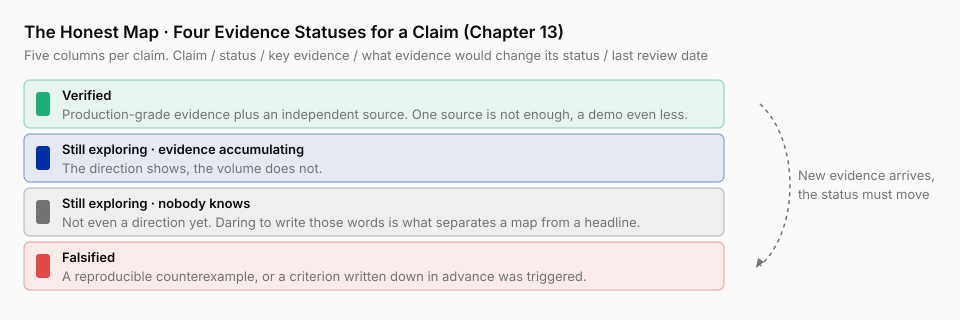

# Chapter 13 · An Honest Map

!!! info "Chapter companion"
    📋 [Chapter 13 templates](../appendices/ch13-templates.md) · 🗂 [Template index](../appendices/template-index.md)

> **This chapter's ladder.** This chapter is outside the seven steps, so it carries no ladder line. Chapter 3, section 3.5 marks the capability water line, how high AI can stand at each step. This chapter marks the evidence status of claims, which of the many things said about this shift can be believed.
>
> In the same week, "AI can now do science on its own" and "AI research is all a bubble" will show up in your feed one after the other, each with papers to back it. A third headline will not save you. What you lack is a map that labels evidence status.
>
> **This chapter delivers.** A fourteen-row honest map, the status rules (definitions for the three statuses plus two disciplines), and a method for re-deriving it row by row.

---

## 13.1 Two headlines in one week

Monday morning, your feed pushes the first one. "Milestone. An AI system picked the topic, ran the experiments, and wrote the paper on its own, and the paper passed peer review." The picture is a flowchart, a screenshot with no humans in the author list, and a round of cheering. Thursday night the second one lands. "Bubble bursting in real time. A spot check shows that papers with deep AI involvement fail replication on a large scale, and several top conferences are tightening policy." The picture is a downward curve, also with a round of cheering, from a different crowd. Both are collages, but you probably scrolled past their relatives last week.

Both come with demos, both cite papers. In the reposts of both, there are smart people you know.

A colleague forwards you both together, with one line, "So which one is true?"

The question cannot be answered the way it is asked. Its unit is wrong. A headline's unit is the event, some system passed some review, some spot check found some percentage. A judgment's unit is the claim. Does "AI can produce publishable research on its own" hold? Does "AI involvement lowers reliability" hold? How much support one event gives one claim depends on the basis of the evidence, on whether the sources are independent, on whether anyone has seriously tried to knock it down. The headline, as a genre, has no room for any of that.

Information you do not lack. On this topic in 2026 there is far too much of it. What you lack is a map that pins each claim to its evidence status. Is this one verified, still exploring, falsified, or does nobody know at all.

This chapter hands over that map. It is the book's master ledger. Every claim gets a row, with a status, the evidence, and a review date. Whether a map dares to write "falsified," whether it dares to write "nobody knows," decides whether it is a judgment tool or one more piece of carefully worded promotion.

## 13.2 What this map marks, and what it does not

First a boundary, so you do not take this map for a reprint of the one in Chapter 3. **The snapshot in section 3.5 marks AI's capability water line**, **this chapter's map marks the evidence status of claims**. One gauges the water, the other audits the books. The water gauge tells you at which step you can let go. The ledger tells you in which argument you can place a bet.

Each row of the map has five columns.

**Claim.** It must be written as one sentence that can be judged true or false. "Multi-agent has a lot of promise" does not get onto the map, because no evidence can hit "promise." "A multi-agent team beats a single model" can get on. It can die. A statement that cannot be written in falsifiable form is only a slogan, and slogans have no seat on this map.

**Current status.** Three statuses, verified, still exploring, falsified. The operational definitions for assigning one are in the rules card in this chapter's appendix. Here only the skeleton. Verified requires production-grade evidence plus an independent source. One source is not enough, a demo even less. Falsified requires a reproducible counterexample, or a criterion written down in advance that was triggered. Whatever reaches neither end is still exploring. Inside that status there are two grades. **Evidence accumulating**, the direction shows, the volume does not. **Nobody knows**, not even a direction yet. Daring to write "nobody knows" is the first thing that separates this map from a headline. Counting the two grades inside still exploring, the figure below draws four boxes.



**Key evidence.** The hardest few items that hold up the current status. Each must be identifiable. Papers, controlled measurements, and practice that many users can reproduce all count. A controlled measurement puts the AI's result next to a baseline, for example the result of doing it by hand, instead of taking AI's word for how well it did. "Industry consensus" is not accepted. "Everyone says so" is not accepted.

**What evidence would change its status.** The most valuable column on the whole map. It forces you to admit, at the moment you write a status down, that the status can die, and to write down in advance how it dies. With this column the map is alive. With it empty, the map decays into one more list of positions. This is the muscle the "how much I believe it" column on the Chapter 4 paper card trained, doing the same work here.

**Last review date.** This edition's baseline is 2026-07. Five of the rows were reviewed once more in 2026-08 against public accounts of the automated research systems of the time, and are marked 2026-08 separately. What this column is for waits for section 13.6. For now, one sentence. A judgment without a review date will not notify you when it expires.

Assigning a status has two more disciplines, both stolen from the transfer map, and they happen to be what kills most headline claims. Row 2 of the transfer map says, **a dazzling demo does not mean production-ready**. So demo videos, case write-ups, and vendor material only ever qualify to trigger an investigation on this map, never to decide a status. Status recognizes production-grade evidence only. Row 3 of the transfer map says, **self-perception is not trustworthy, calibration comes from measurement**. So "everyone who used it says it's great" does not go into the evidence column. Controlled measurements do.

## 13.3 The map itself, fourteen rows

Where do the rows come from? Half from this book itself. Earlier chapters made judgments, and now the bill is due. The other half from the field, the big claims that get reposted the most. If you do not label their status yourself, they move into your judgment with "true by default" as their posture.

Read the status column first, then the fifth column. The other columns can be skipped on a first pass. Come back to them when a specific decision needs them.

| # | Claim | Current status | Key evidence | What evidence would change its status | Last reviewed |
|---|---|---|---|---|---|
| 1 | Literature scanning and structured distillation can be handed to AI (assistant level) | Still exploring (evidence accumulating) | Many everyday users can reproduce it, but by the second discipline in this section that is self-perception, not controlled measurement, and it cannot hold up "verified"; the only hard evidence is the operating form itself (the three-layer intake workflow in Chapter 4), which proves the procedure can be executed, not that the output is reliable | A controlled measurement. AI distillation's qualifier loss rate vs a human baseline → meets the bar, upgrade to "verified"; exceeds it, downgrade to full verification | 2026-07 |
| 2 | The output of a fully automatic literature review can serve as a map of the field | Still exploring | Usable as a first draft; errors and omissions cluster in the judgment of "which argument matters" (Chapter 4, 4.7) | Its controversy structure stays consistent with domain experts' maps in blind tests → upgrade | 2026-07 |
| 3 | With criteria guardrails in place, the execution step can be raised to collaborator level | Still exploring (evidence accumulating) | Verified on the coding side; on the research side it is **a transfer argument, not a direct measurement**, meaning the coding-side conclusion is carried over and reasoned from, not measured on the research side itself. Transfer is this book's strongest reasoning tool, but by the same standard as row 4, an argument does not get into the "verified" column; the execution step sitting closest to cheap ground truth (Chapter 3, 3.4) is mechanism support, not production-grade evidence | Controlled measurement in a research setting, collaborator-level execution with full guardrails vs full human review, error rate and output volume → meets the bar, upgrade to "verified"; or a batch of research accidents of the "all tests green, conclusion wrong" kind → downgrade to "falsified" | 2026-08 |
| 4 | A multi-agent team beats a single model (unconditional form) | **Falsified** | Chen et al., NeurIPS 2024, performance is non-monotonic in the number of calls; Smit et al., ICML 2024, under default settings debate does not reliably beat self-consistency; Wang et al., ACL 2024, a strongly prompted single agent nearly catches up | None. The unconditional form is dead; the live argument is in the next row | 2026-07 |
| 5 | After cost alignment, teaming still has a net gain on specific task families | Still exploring (evidence accumulating) | The two camps face off in the Chapter 4 controversy map; after alignment the conclusion is highly task-dependent; two systematic evaluations in 2025–26 each carry counterexamples, homogeneous debate usually loses, heterogeneous model pools and multi-hop tasks come out differently, full names and qualifiers in Chapter 4, 4.5 | Someone does the full version, dollar basis + same-budget self-consistency as the third arm + decision-grade comparison across task families. The spine case delivered the first data point, but its same-budget arm was ruled a breach by its own red team (see row 13). By the middle of 2026 companies began publishing automated-research technical reports (such as AlphaLab from the Morgan Stanley team), with no cost-aligned basis in sight, so they count only as signals that trigger investigation | 2026-08 |
| 6 | AI can produce publishable research on its own | Still exploring (weak signal) | Four vendor claims, each with qualifiers, workshop and semi-informed review, no independent audit, undisclosed submission, effect size revised down by hand, the case-by-case interrogation at the second stop in 13.4; by the middle of 2026 two more channels were added, public competitions and internal company deployment, both self-reported | Stable acceptance at mainstream venues under informed review + independent replication + someone assigned to answer when it's wrong | 2026-08 |
| 7 | AI-generated fabricated citations and junk papers have entered knowledge production in bulk | Verified (as a phenomenon) | Row 6 of the transfer map, the unit price of "looks rigorous" has been pushed down; the Lancet 2026 audit (2.5 million papers, fabricated citations up 12-fold in three years, 1/277), scale evidence in Chapter 2 | Verification infrastructure spreads and the inflow rate drops significantly → relabel "contained" | 2026-07 |
| 8 | Personas / synthetic data can replace surveying real people | Still exploring (counter-mechanisms accumulating) | Of the five ways of passing for real, the fluency illusion is a mechanism fact; variance collapse (Bisbee et al. 2024) and stereotype drift (Cheng et al. 2023) have peer-reviewed measurements (the Chapter 11 dissection) | The results of the Chapter 12 three-criteria verification, see row 14 | 2026-07 |
| 9 | Users' self-perception of AI speedup can be trusted | Falsified (coding side); still exploring on the research side | METR controlled study (numbers checked, detailed in Chapter 2), predicted beforehand +24% / self-rated afterward +20% / measured −19%, wide confidence interval (row 3 of the transfer map) | Controlled measurement in a research setting; if self-estimate and measurement agree → rewrite the research side | 2026-07 |
| 10 | Model upgrades will solve reliability problems on their own | Still exploring (every historical precedent says no) | Five paradigm shifts without exception, new capability manufactures new error types in bulk (row 7 of the transfer map, verified) | A model generation appears whose error rate, with no external verification process, is no higher than that of teams that have one | 2026-08 |
| 11 | What AI eats is the transcription part of the research craft, not the judgment | Still exploring | The CAD precedent (row 11 of the transfer map); research-side evidence unsettled (Chapter 14 expands) | Stable evidence of automated competence on judgment work (picking the topic, setting criteria, setting claim strength) appears → redraw | 2026-08 |
| 12 | "Cost-matched comparisons are a gap in the literature" (this book's first-draft judgment in Chapter 4) | **Falsified** (2026-07-18) | Forward-citation check, cost-matched comparisons exist, and they cluster on the skeptics' side (Chapter 4, 4.5) | None. Kept as a tombstone, a specimen of motivated collusion | 2026-07 |
| 13 | Spine hypothesis H, cost-matched, the small-model army trails the frontier model by ≤ 2 percentage points on the chosen task families | Mixed, not falsified and not holding across the board (task-dependent) | The code slice cannot detect a direction difference (reading unsettled, about 1/25 the cost per call, list-price basis, meaning billed at third-party inference vendors' posted prices); knowledge QA (only three subjects measured, business, law, psychology) trails by 9–25 percentage points; the math family retired in both directions; "real teaming beats sampling a single small model" got no evidence anywhere in the case. The falsification condition was not triggered. Numbers and how to read them in 13.5 | A retest on a larger task sample with template concentration removed; or rerun the three arms with an army from a larger size tier | 2026-07 |
| 14 | Persona surveys can be used to rehearse interviews / questionnaires | **Falsified** (2026-07-25); the downgraded claim "wording tuning only" still exploring | All three criteria failed, six subgroup distribution distances close to or above twice the threshold (lowest subgroup 1.94×), top-choice agreement rate (the share of questions where both sides' most-voted option is the same) 40% against a threshold of 70%, variance collapse on 80% of clean questions (the Chapter 12 verdict block, traceable in the repo) | Change the persona construction method (such as real-person seed calibration) and retest all three criteria → reopen this row. The three limits on this row's falsification must be read with it, see 13.5 | 2026-07 |

The short literature citations in the table have their full names, baselines, and qualifiers in the battlefield record of Chapter 4, section 4.5. This chapter does not retell them. It stops at four places only, the four that best show this map's temperament.

## 13.4 Four places worth stopping at

**First stop, row 4, daring to mark "falsified."** The unconditional form of "multi-agent beats single model," that is, the line in marketing copy and repost captions that "a team always beats a solo," has been punched through, and not on a single piece of evidence. Chen et al. ("Are More LLM Calls All You Need? Towards the Scaling Properties of Compound AI Systems", NeurIPS 2024, arXiv:2403.02419) measured the performance of Vote / Filter-Vote systems as **non-monotonic** in the number of calls, and the mechanism is that easy and hard queries are mixed within a task. Smit et al. ("Should We Be Going MAD?", ICML 2024, arXiv:2311.17371) found that **under default settings** debate does not reliably beat self-consistency, that is, sampling the same model several times and taking the majority answer. After tuning it can partly pull ahead, but that is already a conditional proposition. Wang et al. ("Rethinking the Bounds of LLM Reasoning: Are Multi-Agent Discussions the Key?", ACL 2024, arXiv:2402.18272) had a strongly prompted single agent nearly catch up with multi-agent discussion. All three papers hit the same word, "unconditional."

Note that the enthusiasts' load-bearing papers did not collapse. The gain in Li et al. ("More Agents Is All You Need", TMLR 2024, arXiv:2402.05120) is real, only the gain rises and then falls with task difficulty, and what Llama2-13B×15 caught up with was a **single query** of Llama2-70B. Wang et al. ("Mixture-of-Agents", ICLR 2025, arXiv:2406.04692) took 65.1% on AlpacaEval 2.0 against GPT-4o's 57.5%, with a "length-controlled" qualifier. Add the source paper of debate, Du et al. (ICML 2024, arXiv:2305.14325).

Both camps' evidence is real. What died is only the unconditional proposition, and the surviving argument moved into row 5. The conclusion is highly task-dependent, and decision-grade evidence has only begun to accumulate. "Only begun" is to be read literally. The comparison the fourth column of row 5 describes has not been done in full by anyone to date, this book included.

**Second stop, row 6, "AI can produce publishable research on its own."** This is the loudest claim of the moment, and its status only rates "still exploring, weak signal." Spread the vendors' claims out, and none of the four survives being repeated in full, and none passes the three questions below. Sakana's AI Scientist-v2 got a paper generated end to end by AI through a workshop at ICLR 2025. The organizers knew and approved in advance, the reviewers were told AI papers were mixed into the submissions but not which ones, and after acceptance Sakana withdrew the paper as promised beforehand, so it never entered the formal publication record. Intology's Zochi claims a main-conference acceptance at ACL 2025 (acceptance rate about 20%), the highest-venue case in this batch of systems, but the rebuttal, the written reply to reviewers' comments, was written by humans, the result is vendor-reported, and there is no independent third-party audit. Autoscience's Carl submitted without disclosing to the organizers, and the paper was withdrawn once it was found out. FutureHouse's Robin made it into Nature, the wet lab work was done by humans, and the 7.5× effect size AI reported was revised down to 1.75× on human reanalysis. Reports of this kind have to pass three questions. What level is the venue? Was the review informed? How far did humans intervene in the process? A harder question comes from the ladder in Chapter 3. The fourth criterion of the autonomous researcher level, who answers when it's wrong, still lands on nobody. One paper being accepted only says it passed one spot check. It does not say the process that produced it deserves the name "autonomous researcher."

By the middle of 2026 two more kinds of channel had grown outside this list, worth recording separately. One is public competition. Weco's Aiden ran for three straight weeks in Parameter Golf, hosted by OpenAI, and set more leaderboard records than any single human entrant (March to April 2026, results vendor-reported, the leaderboard publicly checkable). The "venue" here is a leaderboard plus community reuse, not informed peer review. On the three questions it changed exam halls, it did not pass. The other is inside companies, and what to watch on this road is that "who answers when it's wrong" lands on the company's own risk-control regime. The AlphaLab technical report published by the Morgan Stanley team describes a fully automatic quantitative research pipeline whose models must pass internal risk control before going live (details self-reported, report and code public). So "who answers when it's wrong, still nobody" needs to be said more finely. In the academic publishing setting it is still nobody. In the in-company setting an institutional answer is beginning to appear, at the price that the output never enters the public body of knowledge and trust circulates only inside the walls.

The fourth column of this row is written plainly. Three things together, then it upgrades. Until they come together, every "milestone" on this row is handled by row 2 of the transfer map.

**Third stop, row 1 and row 3, downgraded one notch by this map's own rules.** The first drafts of both rows were marked "verified" and got sent back in a round of reader feedback. The round was run by exactly the kind of AI persona panel the book's subplot had just ruled unable to replace real people. This has to be labeled clearly on the spot, or it becomes a slap in the book's own face. What the personas raised here was **a logical inconsistency that can be verified independently**. Checking it against the written disciplines in section 13.2 settles it true or false on the spot, with no need to trust the judgment of whoever raised it. What Chapter 12 falsified was **distributional fidelity**, whether persona answers can represent the distribution of opinion in a real population. Something that cannot replace real people as respondents can still handle "checking written rules line by line," which is mechanical cross-checking. That is exactly the boundary row 2 and row 3 of this chapter mark out together. The execution step can be let go (row 3), judging which argument matters cannot (row 2). AI can audit your books. It cannot place your bets.

The evidence column of row 1 originally read "many everyday users can reproduce it." Section 13.2 states in black and white, "everyone who used it says it's great" does not go into the evidence column, controlled measurements do, and row 9 had just used METR's three-level contrast to falsify "self-perception" wholesale. **Using a type of evidence this map has just shot dead to issue a pass certificate to another row of the same map**, this is the hardest kind of inconsistency to catch yourself. The two rows sit eight rows apart, and each reads fine on its own. Row 3 likewise. Its evidence is a transfer argument carried over from the coding side. Measured by the same ruler as row 4, "three empirical papers against one proposition," reasoning is not measurement, and one transfer argument does not get into the verified column.

Both rows were downgraded to "still exploring (evidence accumulating)," and the fourth column was rewritten as a concrete upgrade measurement. It is recorded here because it exposed a reusable self-check move. **Ask of each of your own rows, "how did I treat this column's type of evidence elsewhere on this map?"** The same type of evidence enjoying different treatment in different rows means one of the rows has your preference mixed in. Where the preference lands also follows a pattern. Row 1 and row 3 are both "AI works well in the places I know," which happen to be the two rows I most wanted to be true. The line in section 13.8, "the most dangerous row is the one you want to be true," I had thought was written for the reader.

**Fourth stop, row 12, the book's own tombstone.** How the claim "cost-matched comparisons are a gap in the literature" survived a whole round of scanning and then died in a forward-citation check, that is, looking up who later cited a paper, Chapter 4 has the scene and Chapter 11 has the full dissection from the angle of motivated collusion. It is not retold here. A map's credit depends on whether it dares to pin its own corpse to the board. How many rows it got right comes second.

## 13.5 The last two rows, left blank when the plan was written, backfilled with status only

Rows 13 and 14 were empty in the first draft of this chapter. The criteria were signed off first, and the filing slot was built to wait for the results. Now the results are back, and the act of filling them in is itself worth a look.

The task families, three-arm comparison, cost basis, significance test, and falsification conditions of spine hypothesis H were all signed off in Chapter 6, before the runs started. So when the result landed as the mixed ending "on some task families no gap can be detected," row 13 got one status and a link to the results file, with no reopening of the debate. In Chapter 4 I placed private odds, narrow tasks have a shot, a general tie is doubtful. The second half came true, a general tie really did not happen. The first half can only be called not lost. The sturdiest finding in the whole case is that a single small model cannot be told apart from frontier on the saturated code slice. The reading is uninformative, not a tie. The numbers are 94.7% for the self-consistency arm, 93.7% for the army arm, 96.0% for frontier, at about 1/25 the cost per call (list-price basis). The "army" itself never beat sampling. The knowledge QA cell is marked "read as the joint CI interval of the two preregistered arms." The reading goes like this. Each of the two preregistered arms yields a confidence interval for its gap to frontier, and the lag is taken as the union of the two intervals, the lower bound the lower of the two, the upper bound the higher. Plainly, the two intervals are joined into the widest one. A confidence interval itself is the range the gap most likely falls in.

The phrase "list-price basis" has to pin down the extrapolation radius, because it decides whether this result can be used in your decision. The whole case was billed at API list prices, the posted prices third-party inference vendors charge for open-source models. So what it answers is **renting small models vs renting frontier**. "Building your own cluster vs buying the API" is a different question. The cost drivers change to GPU depreciation, utilization, batch throughput, and ops staff, which can differ from list price by multiples, with no guarantee even the direction agrees. The company decision, "self-host or pay for the API," gets no answer from this case, only a method and one data point on a rental basis. Read this limit as main text. It is part of the "not in full" in row 5's "has not been done in full by anyone to date," this book included. Betting in public means one thing only, that "I knew it all along" has nowhere to hide.

The subplot likewise. The three criteria for the persona survey were locked in Chapter 12, and all three failed. Row 14 was filled with "falsified" in the preregistered falsification shape, and the downgraded claim was marked "still exploring" by what the experiment actually covered. No new trial was opened, no defense was filed.

The "falsified" in row 14 carries three limits, and reading that row means reading them too. One, the preregistered criteria are a single experiment, with thresholds set by this book. Two, the ground truth (WVS-7, the questionnaire of the seventh wave of the World Values Survey) is most likely in the training corpus, and with the real-person arm cut this cannot be ruled out, so every conclusion carries that proviso. Three, 10 of the 15 questions were flagged by the contamination test, and from a single source "memorized the original item" cannot be separated from "sensitive to wording." The directional evidence (Bisbee 2024, Cheng 2023) stands independently. This experiment is the third data point, not the verdict.

Both rows can point to specific commits in the repo. What you just saw is what "criteria locked first, results fill in status only" looks like in a book. Most headlines cannot do this. Their criteria get written only after they see the result.

## 13.6 How to re-derive this map yourself

This map starts expiring the moment it is printed. So its value is in the method. The five-column structure plus the two ruling disciplines are enough for you to re-derive it any time.

A review does not require rereading every paper. **Review = run the fifth column, row by row.** The "what evidence would change its status" column is itself a ready-made search instruction. All you do is go and check whether that kind of evidence has shown up. After checking, only three moves are allowed. Change the status (the evidence arrived), change the evidence (a harder source replaced it), change the date (checked, nothing moved). The third is the easiest to underrate. Even when only the date changes, it must change. A map whose review dates do not move is a dead map, and a dead map is more dangerous than no map, because it still wears the skin of a map.

On cadence, a suggestion, with the full version in the appendix. Verified rows, check every six months, or at once on a field-level event. "Evidence accumulating" rows, every three months. "Nobody knows" rows, event-driven, check the moment the kind of evidence the fifth column describes shows its head. Falsified rows are not reviewed. Tombstones do not need watering, but they stay on display.

As for how the official version of this map keeps updating, that is part of the book's living book mechanism, delivered in Chapter 16.

## 13.7 Swap in your project

Now draw one for your own field. This is the hardest exercise block in the book, and the most valuable, so the starting bar has to be pressed as low as it goes.

1. **Do not start from "what are the big claims in my field."** That question is too big, and you will list a pile of slogans. Dig out your most recent deliverable, a report, a paper, a presentation, a review, any will do, and copy out the claims in it that you **cited or took as true by default**, until you have 10. These are the rows you are already betting real money on.
2. **Fill only two columns per row at first**, the claim and your gut status right now. Force the claim into one sentence that can be judged true or false. Where it will not go, you will discover on the spot that you have been citing a slogan, and that alone is a gain.
3. **Fill in the fourth column**, "what evidence would change its status." Rows where you cannot fill it in, downgrade to "still exploring (nobody knows)" without exception. A claim whose death you cannot write down, you do not actually know what keeps it alive.
4. **Fill in the evidence column**, each item identifiable. If you cannot write anything harder than "everyone says so," go back to step 3 and downgrade.
5. **Mark today's date and set the cadence.**

Leave yourself one self-check signal. Ten rows all "verified," and what you listed is a placebo, not a map. Go back to step 1 and add the claim you least dare to touch. The complete fillable version of this chapter's template (with the status rules card and the review cadence table) is in the appendix.

**Want an agent to run it with you?** Paste this to your AI assistant or coding agent:

```text
Help me draw the Chapter 13 honest map. I will paste you my most recent deliverable. You do one thing only, copy out the claims in it that I cited or took as true by default,
until there are 10, and force each into one sentence that can be judged true or false. Ones that will not go, keep as is and label "slogan". Build an empty five-column table
from Template A in docs/appendices/ch13-templates.md. I fill in the gut status, I write "what evidence would change its status", and any row I cannot write you downgrade
to "still exploring" by the rules card. Every item in the evidence column must be identifiable. If I write "everyone says so", send it back. At the end mark today's date,
and set the review cadence by Template C. If all ten rows come out "verified", remind me that is not a map. If any command errors, stop and show me the output.
```

## 13.8 Sober reminders

- **This map will expire, and it will not notify you.** Any of the fourteen rows may flip before the next review. Flipping is written into the definition of this kind of map, and it is no defect. What you should trust is the five-column structure and the ruling disciplines, not the specific cells of this 2026-07 edition.
- **The most dangerous row is the one you want to be true.** The tombstone in row 12 is the proof. Motivated collusion works on the person making the map, and on the person writing the book. Set one rule for your own map. For any row where "this row holding is good for me," the required evidence level goes up one notch automatically.
- **Do not outsource the map to AI for fully automatic upkeep.** AI can run the fifth column's searches for you, and that is a good use. Let it change the status directly and you will get a map where every row is fluent, complete, and confident, and the coverage illusion (AI never volunteers which block it missed, Chapter 4) replays at map scale. Status changes must pass through a human. That step is the last barrier between this map and the thing it is trying to resist.
- **Other people's maps, copy the structure, not the status.** This book's included. A status is a reading of the evidence at one point in time, through one pair of eyes. You can take these fourteen rows as a starting point, but pick at least two or three rows and run the fifth column with your own hands. Only after running it will you believe it, and only once you believe it will you actually use it.
- **Still exploring.** The fifth column depends on a human to run it. How often, who runs it, and how to notify the people who already cited a row when it flips, this book gives only the one-hour-a-month recipe in Chapter 16 and has not verified that it holds up in readers' hands. The update mechanism of this map is itself the row it is least sure of.

## 13.9 The unfair advantage you now hold

Headlines have been demoted at your desk, from a supplier of conclusions to a review trigger. Two dueling news items come in, and you no longer ask "which one is true." You open the map and ask which row it moves, whether the evidence passes those two disciplines, and whether this row's review should be brought forward. Ten minutes later you close the map, while people without one are still choosing between reposting and panicking.
