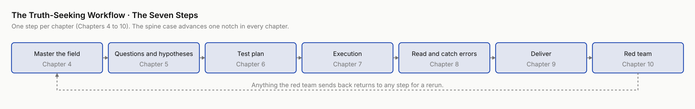

# Research, Rewritten

> **Research, Rewritten: Using AI to Produce Knowledge You Can Trust**

**Deep research gives you plausible. This book gives you reliable.**

This is a hands-on book, written for software and AI engineers who have to do research at work. You are asked to sign off on a technical judgment (can a small model replace the large one, should the retrieval layer be swapped, can this AI report be trusted), and the evidence is an experiment anyone can rerun. The signature is yours. Academic researchers, analysts, and people doing due diligence can use the same process, with the shape of the case converted as Chapter 3, section 3.6 shows. What they share: if your answer is wrong, someone, some money, or some decision really gets hurt.

It teaches you to wire general-purpose AI and agents into every step of truth-seeking work, from reading the literature, asking questions, and designing tests, to running analysis, reading results, writing, and red-teaming. At every step it says three things plainly, where you can hand it to AI, where you must gate it yourself, and where nobody knows yet.



## Where to start

- **Only 2 hours** → [Start Here](chapters/ch00-start-here.md). Run a real experiment in two hours, get a number that makes your heart race, and a seven-item list that shuts it up.
- **People who do research or analysis hands-on** → the main line, Chapters [4](chapters/ch04.md) to [10](chapters/ch10.md). One step of the truth-seeking workflow per chapter, and each chapter ends by translating that step onto your own project.
- **People who mainly accept other people's AI output** → Chapter [11](chapters/ch11.md) for the failure modes, Chapter [12](chapters/ch12.md) for the two-hour acceptance workflow, and the four attack surfaces of Chapter [10](chapters/ch10.md) as an acceptance checklist.
- **People who lead teams and set direction** → Chapters [1](chapters/ch01.md) to [3](chapters/ch03.md) for the frame, Chapters [13](chapters/ch13.md) to [15](chapters/ch15.md) for the map of the present and team adoption.

## Chapter overview

| Chapter | Title | Templates | Code |
|---|---|---|---|
| [Preface](chapters/ch-preface.md) | This Book Was Put on Trial | / | [smol-army](https://github.com/hallieren/research-rewritten/tree/main/code/smol-army/) · [persona-panel](https://github.com/hallieren/research-rewritten/tree/main/code/persona-panel/) |
| [Start Here](chapters/ch00-start-here.md) | A Two-Hour Win | / | [smol-army](https://github.com/hallieren/research-rewritten/tree/main/code/smol-army/) |
| [Chapter 1](chapters/ch01.md) | After Coding, Research | [Templates](appendices/ch01-templates.md) | |
| [Chapter 2](chapters/ch02.md) | A Map Stolen from Paradigm Shifts | [Templates](appendices/ch02-templates.md) | |
| [Chapter 3](chapters/ch03.md) | The Truth-Seeking Workflow and the Autonomy Ladder | [Templates](appendices/ch03-templates.md) | |
| [Chapter 4](chapters/ch04.md) | Master a Field | [Templates](appendices/ch04-templates.md) | |
| [Chapter 5](chapters/ch05.md) | Questions and Hypotheses | [Templates](appendices/ch05-templates.md) | [persona-panel](https://github.com/hallieren/research-rewritten/tree/main/code/persona-panel/) |
| [Chapter 6](chapters/ch06.md) | Turn an Idea into a Falsifiable Test Plan | [Templates](appendices/ch06-templates.md) | [persona-panel](https://github.com/hallieren/research-rewritten/tree/main/code/persona-panel/) |
| [Chapter 7](chapters/ch07.md) | Execution | [Templates](appendices/ch07-templates.md) | |
| [Chapter 8](chapters/ch08.md) | Read the Results, Catch the Errors | [Templates](appendices/ch08-templates.md) | [smol-army](https://github.com/hallieren/research-rewritten/tree/main/code/smol-army/) · [persona-panel](https://github.com/hallieren/research-rewritten/tree/main/code/persona-panel/) |
| [Chapter 9](chapters/ch09.md) | Delivery | [Templates](appendices/ch09-templates.md) | [smol-army](https://github.com/hallieren/research-rewritten/tree/main/code/smol-army/) |
| [Chapter 10](chapters/ch10.md) | Red Team | [Templates](appendices/ch10-templates.md) | [persona-panel](https://github.com/hallieren/research-rewritten/tree/main/code/persona-panel/) |
| [Chapter 11](chapters/ch11.md) | Failure Modes Unique to Research | [Templates](appendices/ch11-templates.md) | [persona-panel](https://github.com/hallieren/research-rewritten/tree/main/code/persona-panel/) |
| [Chapter 12](chapters/ch12.md) | The Verification Workflow | [Templates](appendices/ch12-templates.md) | [persona-panel](https://github.com/hallieren/research-rewritten/tree/main/code/persona-panel/) |
| [Chapter 13](chapters/ch13.md) | An Honest Map | [Templates](appendices/ch13-templates.md) | |
| [Chapter 14](chapters/ch14.md) | The Researcher's New Craft | [Templates](appendices/ch14-templates.md) | |
| [Chapter 15](chapters/ch15.md) | Make It a Habit and a Capability | [Templates](appendices/ch15-templates.md) | |
| [Chapter 16](chapters/ch16.md) | Coda · How This Book Stays Current | [Templates](appendices/ch16-templates.md) | |

All templates are indexed in the [Template index](appendices/template-index.md).

## The spine case that runs through the book

**Can a team of small open-source models tie a single frontier model?** Two camps of papers fight it out in the literature. Nobody knew the answer in advance. The author ran it by hand from doubt to conclusion, through the literature, hypotheses, preregistration, experiments, delivery, red team, and submission and its beatings, and every pit is written down as it happened. Every number points to raw results in the repository. You do not need to believe it. You can rerun it.

## This book was verified by its own method

Preregistrations, red-team records, cost ledgers, raw results. The entry point is the [Experiment ledger index](experiments.md).

## Companion code in 30 seconds

```bash
git clone https://github.com/hallieren/research-rewritten.git
cd research-rewritten/code/smol-army
uv sync --extra dev && uv run pytest        # offline unit tests
uv run python -m smol_army.run --mock       # no spend, the whole chain runs offline
```

Both subprojects are managed with [uv](https://docs.astral.sh/uv/), and `--mock` mode costs zero API spend. A real run needs `OPENROUTER_API_KEY` and `OPENAI_API_KEY`, see each project's README.

**Want an agent to set it up?** Paste the block below into Claude Code, Codex, or any coding agent:

```text
Clone https://github.com/hallieren/research-rewritten, read code/smol-army/README.md and code/persona-panel/README.md,
run uv sync --extra dev and uv run pytest in both directories, then run uv run python -m smol_army.run --mock in code/smol-army,
and show me the output verbatim. Use uv only, not pip or conda. Ask me before any command that needs an API key, do not run it yourself.
If any command errors, stop and show me the output.
```

After each chapter's exercise block there is a "Want an agent to run it with you?" instruction. It walks you through the chapter's appendix prompt set and leaves the criteria and the signature to you. An agent can also read the whole book, [llms.txt](llms.txt) is the index and [llms-full.txt](llms-full.txt) is the full text. For offline reading there is the [EPUB](research-rewritten.epub).
